# migration-workbench

Reusable Django chassis for **tabular workbook → app migrations**: connectors pull from spreadsheets (Google Sheets) or Coda; profiling produces deterministic bundles; importers validate and apply with structured summaries; the workbook app turns profiles into schema-contract YAML for product repos to harden into real models.

**PyPI:** [migration-workbench](https://pypi.org/project/migration-workbench/) — `pip install migration-workbench` (import package `migration_workbench` uses underscores).

## Prerequisites

### Docker

This project uses Docker for building and deploying. Your system user must be in the
`docker` group to run Docker commands without `sudo`:

```bash
# Add your user to the docker group
sudo usermod -aG docker $USER

# Apply the group change in the current shell session
sg docker -c "docker ps"
```

After running these commands, **log out and back in** (or use `sg docker -c "your command"`)
for the group change to take effect permanently.

> **Troubleshooting:** If you see `permission denied while trying to connect to the Docker
> API at unix:///var/run/docker.sock`, you have not completed the steps above.

## Who it is for

- **Product teams** moving messy spreadsheet truth into a maintainable Django app.
- **Single-operator or small teams** who want a repeatable pipeline (profile → contract → import) instead of one-off scripts.
- **Django-adjacent adopters** comfortable wiring `INSTALLED_APPS`, env vars, and Fly-style SQLite hosting.

## Three ways to use it

**1. As a library (recommended for product repos)**  
Add the apps you need to `INSTALLED_APPS` and wire URLs/commands in **your** Django project. Set `**DJANGO_SETTINGS_MODULE`** to your project’s settings module (not `migration_workbench.settings`) in production. Depend on a released version, e.g. `migration-workbench>=0.1.0,<1`.

**2. Scaffold a new product repo**  
From a sibling checkout of this repo:

```bash
make new-product PRODUCT=my-product   # writes ../my-product; git init + initial commit
make new-product PRODUCT=my-product PROVIDER=--coda
```

Then `cd ../my-product && make install && make migrate && make check`. Local **`make install`** matches the **Dockerfile**: the product package is editable (`pip install -e .`) and **`migration-workbench` comes from PyPI** via `pyproject.toml`. The scaffold also includes `backend/`, `Makefile`, `scripts/entrypoint_product.sh`, SQLite/Fly-aligned settings (`SQLITE_PATH`, `/healthz`, WAL pragmas), starter docs, and provider-specific config skeletons under `config/` (Google Sheets by default; use `PROVIDER=--coda` for Coda). If `git` is on `PATH`, the scaffold initializes a repo and writes one initial commit using a scaffold-local author identity. Use `--output-dir` / `--force` on `scripts/new_product.py` for non-default paths.

**3. Develop the chassis (this repo)**  
Clone, editable install, run the full gate:

```bash
python3 -m venv .venv
.venv/bin/pip install -e ".[dev]"
. ./.env.example   # or create .env
.venv/bin/python manage.py migrate
make chassis-gate
```

## Quickstart (PyPI)

```bash
python3 -m venv .venv
.venv/bin/pip install "migration-workbench[dev]"   # omit [dev] if you skip pytest/black
```

Use `wb` on your PATH, or import apps (`connectors`, `profiler`, `importer`, `workbook`, `deployment`, …). For consumer repos installing the chassis next to your code: `pip install -e ../migration-workbench` — see [profiler/README.md](profiler/README.md) for profiling commands and [importer/README.md](importer/README.md) for import authoring.

Core bundle commands (from a project with `manage.py`):

```bash
python manage.py pull_bundle --config docs/examples/live-config.example.json --output-dir /tmp/bundle
python manage.py snapshot_bundle --config docs/examples/offline-config.example.json --output-dir /tmp/bundle
python manage.py import_reference_example example_data --validate-only
```

Note: bundled `**migration_workbench.settings**` is for development; production hosts use their own settings module.

## Architecture at a glance

Five Django apps:


| App                                | Role                                                             |
| ---------------------------------- | ---------------------------------------------------------------- |
| [connectors](connectors/README.md) | Provider adapters (Sheets, Coda).                                |
| [profiler](profiler/README.md)     | Read-only profiling → normalized bundle artifacts.               |
| [importer](importer/README.md)     | `BaseImportCommand` chassis, preflight/apply, summary JSON.      |
| [workbook](workbook/README.md)     | `scaffold_workbook_schema` → schema-contract YAML.               |
| [deployment](deployment/README.md) | Manifest validation, `wb` CLI (`manifest lint`, deploy dry-run). |

```mermaid
flowchart LR
  sourceConfig["SourceConfigJSON"] --> pullBundle["PullBundleCommand"];
  pullBundle --> providerRouter["ProviderRouter"];
  providerRouter --> adapters["GoogleSheets_or_Coda"];
  adapters --> rawRows["RawRows"];
  rawRows --> normalizer["SpreadsheetNormalizer"];
  normalizer --> bundle["NormalizedBundle"];
  bundle --> importer["BaseImportCommandSubclass"];
  importer --> summary["SummaryArtifactJSON"]
```





More detail: [docs/architecture.md](docs/architecture.md).

## The pipeline

1. **Intake** — Source config (Drive folder, sheet IDs, Coda doc URLs).
2. **Profile** — Profiler commands emit JSON/Markdown under product-owned `data/profile_snapshots/` by default.
3. **Model** — `scaffold_workbook_schema` produces schema-contract YAML for review.
4. **Harden** — Importer tiers validate then apply; summary artifacts record outcomes.
5. **Deploy** — `wb manifest lint` validates [deploy/spaces.yml](deploy/spaces.yml); `wb deploy <space> --env <preview|production> --dry-run` plans releases (provider mutation deferred — see [docs/deployment.md](docs/deployment.md)).

## Deployment

Fly.io + SQLite on a persistent volume + Litestream replication to **Tigris or any S3-compatible** bucket. Operator bootstrap, secrets, CI/CD, rollback, and roadmap for the `wb` control plane: **[docs/deployment.md](docs/deployment.md)**.

## CI/CD


| Workflow     | File                                                                     | Trigger                              | Role                                                                                            |
| ------------ | ------------------------------------------------------------------------ | ------------------------------------ | ----------------------------------------------------------------------------------------------- |
| CI           | [.github/workflows/ci.yml](.github/workflows/ci.yml)                     | push, PR                             | `make chassis-gate`, wheel smoke                                                                |
| Deploy       | [.github/workflows/deploy.yml](.github/workflows/deploy.yml)             | after successful CI (`workflow_run`) | manifest lint → `flyctl deploy` → `/healthz` smoke (`main` → production, `preview/`* → preview) |
| Publish PyPI | [.github/workflows/publish-pypi.yml](.github/workflows/publish-pypi.yml) | tag `v*`                             | Trusted Publishing to PyPI                                                                      |


GitHub repository secret `**FLY_API_TOKEN`** is required for Deploy. Product repos can copy these CI patterns, but workflow files are maintained per repository.

## Status and roadmap

**0.0.x — Component assembly (current, v0.0.9)**

All pipeline stages exist in isolation: profiler, schema contract system, codegen,
import runtime, view manifest, discovery interview, deployment CLI. Each works on
its own. The full end-to-end chain is being exercised on the farm engagement.

- Google Sheets profiler: Phase 0–3 corpus pipeline with domain context integration, tab scoring, column enrichment, computed field and FK candidate detection.
- Coda profiler: doc enumeration, table profiling, formula scanning, canvas extraction, relationship map.
- Schema contract: YAML format with columns, model_meta, extra_fields, computed
  fields, FK resolutions, hooks, import_config, admin blocks. Validate, diff, and
  migration-safety check it.
- Codegen: `generate_models`, `generate_admin`, `generate_import` produce Django
  `*_auto.py` files with stub re-exports. `--continue-on-error`, `--diff`, identifier
  sanitization, `PartialOutputCollector` for resilience.
- Import runtime: `BaseImportCommand` with tier system, atomic savepoints, FK
  resolution, bundle reader, error recording, summary JSON.
- View manifest + discovery: scaffold view manifest from structure artifact,
  generate interview questionnaire, merge operator answers.
- `wb` CLI: `manifest lint`, `deploy --dry-run`/`--live`, `contract {review,diff,safety,validate}`,
  `drift check`, `generate {models,admin,import,manifest}`.
- Deployment: Fly.io deploy with health gate polling, release store (DB + JSONL),
  manifest validation, deploy smoke tests.
- Build system: shared `makefile_targets.py` module, preflight gate, product scaffold.
- Documentation: full doc map, 80% docstring coverage, CI/CD with `chassis-gate`.

**0.1.0 sprint — Pipeline proven on real data**

Next milestone: one product repo (farm) through the full end-to-end pipeline.
Not a demo — the whole machine turns on real data.

The goal is not just "pipeline runs." It is "consultant can complete a paid
engagement in under two days with this tool."

1. **Close broken connections** — fix `wb generate manifest` import path bug,
   build multi-year import loop (import command iterates year directories),
   validate contract→pipeline_manifest→pull_bundle→import coupling.

2. **Farm execution** — profile farm corpus, scaffold and harden contract, generate
   code, pull historical bundles, import all years, generate view manifest, conduct
   discovery interview, deploy to Fly.io with health check passing.

3. **Gate** — pipeline runs from scratch in <30 min with one documented command
   sequence, generated code compiles without manual edits, import creates expected
   rows across all years, deploy passes health check.

0.1.0 is the beta. There is no v1.0 — the version scheme resets so that
0.1.0 is the first release where the whole machine actually turns.

**0.2.0+ — Consultant accelerant**

Each version encodes more consultant judgment into the agent harness,
making the operator faster. Not a feature list — a judgment-compounding system.

- **0.2.0 PipelineState:** Agent reasoning is explicit and auditable.
  Consultant reviews one checkpoint file, not scattered JSON.
  Autonomous decisions where confidence is high; alerts where low.
  See [Pipeline State](docs/pipeline-state.md) and [Agent Harness](docs/agent-harness.md).

- **0.3.0 Vertical templates:** After N engagements in a vertical,
  extract reusable presets. The 10th farm migration is 5x faster
  than the 1st.

- **0.4.0 Interaction contract:** Agent infers how data is used
  (form/list/dashboard/reference). Consultant confirms. Generated
  admin reflects actual business workflows, not generic CRUD.
  See [Interaction Contract](docs/interaction-contract.md).

- **0.5.0+ Platform (conditional):** Only after judgment taxonomy
  is dense enough to make the agent reliably correct.
  Hosted workbench for consultants, not self-service for end users.
  Self-service is a non-goal until proven safe.

Semantic versioning applies; `**0.x`** may ship breaking changes — pin ranges in product repos.

## Releases

1. Bump `**version`** in `[pyproject.toml](pyproject.toml)`.
2. Tag `**v + version`** (must match `version = "x.y.z"`).
3. Trusted Publishing on [PyPI](https://pypi.org/manage/account/publishing/) for this repo (see [publish workflow](.github/workflows/publish-pypi.yml)).

Manual upload: `python -m build` then `twine upload dist/`*, or `make publish` with maintainer credentials. Optional extras: `[release]` for build/twine only.

## Documentation map


| Doc                                                                                               | Purpose                                                       |
| ------------------------------------------------------------------------------------------------- | ------------------------------------------------------------- |
| This README                                                                                       | Orientation, pipeline, roadmap                                |
| [docs/architecture.md](docs/architecture.md)                                                      | Layered design                                                |
| [docs/deployment.md](docs/deployment.md)                                                          | Fly, secrets, Litestream/Tigris, CI/CD, control-plane roadmap |
| [docs/schema-design-loop.md](docs/schema-design-loop.md)                                          | Contract-first importer workflow                              |
| [docs/google-auth.md](docs/google-auth.md)                                                        | Sheets/Drive profiling auth                                   |
| [docs/google-corpus.md](docs/google-corpus.md)                                                    | Drive folder / multi-workbook Sheets corpus profiling         |
| [docs/coda.md](docs/coda.md)                                                                      | Coda profiling                                                |
| [docs/contributing.md](docs/contributing.md)                                                      | Development setup, test suite, PR expectations                |
| [docs/end-to-end-tutorial.md](docs/end-to-end-tutorial.md)                                        | Step-by-step walkthrough from profile to import               |
| [docs/pull-bundle.md](docs/pull-bundle.md)                                                        | Source config, live/offline modes, bundle validation           |
| [docs/schema-contract.md](docs/schema-contract.md)                                                | YAML contract format reference (v1.0–v1.3)                   |
| [docs/view-manifest.md](docs/view-manifest.md)                                                    | View manifest YAML format, admin generation effects           |
| [docs/interaction-contract.md](docs/interaction-contract.md)                                      | Three-layer UI/workflow contract design                       |
| [docs/pipeline-state.md](docs/pipeline-state.md)                                                | Layered profiler runtime state and checkpoint design          |
| [docs/pipeline-manifest.md](docs/pipeline-manifest.md)                                            | Machine-generated execution plan format                       |
| [docs/agent-harness.md](docs/agent-harness.md)                                                  | Consultant accelerant philosophy and confidence taxonomy      |
| [docs/troubleshooting.md](docs/troubleshooting.md)                                                | Consolidated FAQ for common errors                            |
| Per-package `README.md` under `connectors/`, `profiler/`, `importer/`, `workbook/`, `deployment/` | App-local surfaces                                            |


## Changelog

### 0.9.3

- **`model_name` in `build_contract()`:** bundle-config path now produces valid v2 contracts with `model_name` on every table.
- **Makefile targets use `wb generate`:** scaffolded Makefile targets call `wb generate models/admin/import/manifest` instead of `$(MANAGE) generate_*`.
- **`bundle_path` consistency through harden:** `_harden_contract()` preserves existing `bundle_path` and falls back to `_derive_bundle_path()` using model name.
- **Fly.io deployment configs:** `fly.toml` (production) and `fly.preview.toml` (preview) with correct `internal_port`, volume mounts, and release command.
- **Deploy workflow branch fix:** `.github/workflows/deploy.yml` and `deploy/spaces.yml` use `master` instead of `main`.
- **PyPI publish gated on CI:** `publish-pypi.yml` verifies CI passed for the same SHA before building and publishing.
- **Ruff lint in CI:** `ruff check` and `ruff format --check` step added to CI before `chassis-gate`.
- **Import path fix:** `importer/tests/test_sample_guard.py` and `importer/tests.py` import from `importer.sample_guard` instead of `importer.base`.
- **Doc coverage gate:** docstrings added to `workbook/makefile_targets.py` functions, `profiler/tools/enrichment_utils.py`, and management commands to pass the 80% interrogate threshold.

### 0.9.2

- **Rich profiling enrichment:** profiler enrichment functions for computed fields, FK candidates, import keys, and entity groupings (`profiler/tools/enrichment_utils.py`).
- **Coda column enrichment:** `enrich_coda_columns` addsProfiler-column metadata for Coda sources.
- **Cohort corpus enrichment propagation:** enrichment fields flow through scaffold contract generation (`suggested_entity`, `suggested_fk_target`, `is_computed`, `is_import_key_candidate`, `cross_tab_group`).
- **Import key candidates from enrichment:** scaffold uses `is_import_key_candidate` to propose `unique_on` fields instead of always defaulting to the first column.
- **Domain knowledge flag:** `scaffold_workbook_schema --domain-knowledge` loads entity-aware heuristics for contract generation.
- **Scaffold polish:** createsuperuser Make target with env var support, admin URL redirect, sentinel marker in models.py template, PascalCase passthrough in `_to_pascal_case`.
- **Makefile target deduplication:** shared `workbook/makefile_targets.py` module replaces inline Makefile template in `scripts/new_product.py`.
- **Unified `wb` CLI:** `wb generate {models,admin,import,manifest}` and `wb validate contract` subcommands; Makefile targets use `wb` instead of `$(MANAGE)`.
- **`*_auto.py` output convention:** `generate_models` writes `models_auto.py` with stub `models.py` re-export; `generate_admin` writes `admin_auto.py` with stub `admin.py`. Hand-edited files are never overwritten.
- **`model_name` required:** every contract table must have an explicit `model_name` field; `get_model_name()` is a direct accessor, no derivation.
- **Contract admin blocks authoritative:** `generate_admin` uses contract `admin:` blocks as-is; view manifest is enrichment only.
- **`bundle_path` auto-derive:** scaffold always derives `import_config.bundle_path` from model name.
- **`validate_contract` management command:** standalone contract validation without code generation.
- **Clean error on missing `bundle_path`:** import generation gives actionable guidance instead of raw traceback.
- **`--domain-knowledge` example YAML:** `domain-knowledge.example.yaml` shipped with scaffold output.

### 0.9.1

- **Makefile target deduplication:** shared `workbook/makefile_targets.py` module replaces inline Makefile template in product scaffold.
- **Documentation coverage:** docstrings and module docs for connectors, profiler, deployment, and workbook.
- **Documentation index:** `docs/INDEX.md` with cross-references.
- **Pipeline manifest wiring:** `generate-pipeline-manifest` wired into `generate-all` Makefile target.

### 0.9.0

- **Live deploy with health gate:** `wb deploy <space> --env <env> --live` performs a real Fly deploy, polls `/healthz`, and records release events. Outcome taxonomy: `deploy_start`, `deploy_failed`, `deploy_succeeded_healthy`, `deploy_succeeded_unhealthy`.
- **`--local` build flag:** `wb deploy --local` builds with local Docker instead of Fly remote builder.
- **Release ID propagation:** After successful deploy, `RELEASE_ID` is set as a Fly secret for the health endpoint.
- **Improved deploy diagnostics:** `--verbose` / `-v` streams fly deploy stderr/stdout; failed deploys include stderr tail and machine state capture.
- **Product-aware settings detection:** `wb` auto-detects product repo settings at `backend/config/settings.py`; `--django-settings` flag for explicit override.
- **Harden entrypoint:** Docker entrypoint now checks for `/data` volume before creating directories, with actionable error messages.
- **Manifest validation relaxed:** Missing `preview` or `production` environment blocks no longer fail validation.
- **Test reliability:** Subprocess calls in tests use `sys.executable` instead of hardcoded `"python"` for venv isolation.
- **Scaffold improvements:** `deploy/spaces.yml` generated for new products; `deployment` app added to `INSTALLED_APPS`.
- **Code review hardening:** `fly secrets set` always warns on failure; conflicting `--dry-run`/`--live` flags error out; missing `fly` CLI produces actionable install hint; machine state parsing handles non-array API responses.

### 0.8.0

- **Per-tier transaction savepoints:** `--tier-atomic` (default on) wraps each import tier in its own `transaction.atomic()` savepoint. A failing tier rolls back only its own rows; preceding tiers persist. `--no-tier-atomic` restores single-transaction behaviour.
- **Per-row exception catching in generated imports:** Generated `_import_<model>()` methods now catch `IntegrityError` and other exceptions per row, recording structured errors instead of aborting the entire tier.
- **New error codes:** `type_mismatch`, `unique_violation`, and `row_exception` in `FAILURE_SIGNATURE_OWNERSHIP` for structured escalation routing.
- **Per-model row error counts in summary JSON:** Each model's outcome dict now includes `row_errors_count` for quick per-model error tallying.
- **Expanded parsing edge-case handling:** Tests for `None`, whitespace-only, and common sentinel values (`"N/A"`, `"-"`) across all parsers.
- **End-to-end import pipeline fixture:** `ExampleFarm`, `ExampleField`, `ExampleVariety` models with FK chains, `column_map` multi-source, `field_transforms`, and `field_parsers` exercising the full `generate_import` → `BaseImportCommand` pipeline.
- **Bundle reader multi-source fix:** `iter_bundle_tab_rows` now correctly skips list-valued `column_map` entries instead of raising `TypeError`.
- **Import pipeline smoke test in chassis-gate:** `generate_import` exercised with multi-model contract in CI.

### 0.7.0

- **Profile-to-contract bridge — designed model detection:** `scaffold_workbook_schema` now clusters tabs by overlapping column sets (>50% Jaccard-like overlap) and suggests designed/aggregate models with `source_tab: null`. New module `workbook.codegen.designed_model_detection`.
- **Contract review checklist round-out:** `wb contract review` now checks FK lookup target existence, admin inlines target models, and computed_field snake_case naming conventions.
- **`validate-contract` Make target:** Wired into scaffolded product Makefile; aggregates `check validate-contract` for CI.
- **`corpus-codegen-report` Make target:** Runs contract review and Django system check on generated files; corpus feedback tracker doc for capturing papercuts.

### 0.6.0

- **Reserved-character sanitization:** Tab names containing `|`, `:`, `\`, `/`, `*`, `?`, `"`, `<`, `>`, `%` are automatically sanitized to underscore at ingestion, with a logged warning.
- **Tab exclusion by pattern:** Configurable `tab_exclude_patterns` in scoring heuristics — each entry specifies a regex pattern and penalty weight for matching tab titles.
- **Column formula structure analysis:** Profiler classifies columns as `raw`, `row_formula`, `expansion_formula`, `hybrid`, or `empty`. Classification flows into tab scoring (`expansion_formula_ratio` penalty), schema contract field annotations, and column candidate shortlists.

### 0.5.0

- **Migration safety checks:** `wb contract safety --old contract-v1.yaml --new contract-v2.yaml` detects destructive changes (field removed, nullable→non-nullable → DANGER; class change, max_length decreased, unique=True added, non-nullable field without default → WARNING) with text and `--json` output.
- **Null-key robustness:** `_diff_fields()` normalises YAML `null:` mapping keys to the string `"null"` to prevent `TypeError` during kwarg comparison.

### 0.4.0

- **Multi-source column_map with field transforms:** `column_map` values can be lists of source headers; `field_transforms` block accepts lambda expressions for combining columns (default: space join).
- **Contract composition:** Custom `!include` YAML tag resolves relative to including file's directory with cyclic-include detection.
- **Auto-detect import tier ordering:** `assign_import_tiers()` topological sorts FK dependency chains; explicit tiers override auto-detection.
- **Contract diff tool:** `wb contract diff --old contract-v1.yaml --new contract-v2.yaml` compares models, fields, and meta with text and JSON (`--json`) output.
- **Schema review checklist:** `wb contract review --contract <yaml>` checks CharField max_length, nullable FK on_delete, missing unique_together, and str_template.
- **Snapshot testing:** `make snapshot-codegen` / `make check-snapshots` stores generated output for regression detection.
- **`check-generated` Makefile target:** py_compile validation of generated Python files.

### 0.3.0

- **Admin scaffold maturity:** `list_editable`, `autocomplete_fields`, `admin.inlines` field overrides, `--diff` flag for regeneration preview.
- **Post-generation hook system:** `hooks.after_model`, `hooks.after_meta`, `hooks.extra_methods` in contract YAML inject Python source at well-defined points in generated model classes.
- **`scaffold_designed_model` command:** Emit contract table skeletons for designed/aggregate models with no source tab.
- **Admin `--diff` flag:** Preview changes before overwriting; forced regeneration shows diff of detected changes.

### 0.2.0

- **Contract schema v1.3:** `computed_fields` (rendered as `@property`), `is_abstract`, `source_tab: null` for designed models, `app_label` per table in `model_meta`.
- **Makefile improvements:** `validate-contract`, `diff-generated`, `generate-admin-light`, `generate-admin`, `post-generate` targets.
- **Codegen QoL:** `generate_models --diff`, contract validation warnings at codegen time, import generator skip notes.
- Backport AbstractUser admin scaffold support from codegen pipeline.
- Extend contract schema to v1.2: enums, admin config, `model_base`, richer `Meta`.
- Initial codegen pipeline: `generate_models`, `generate_admin`, `generate_import` commands producing production Django files from hardened schema-contract YAML.
- Import generator base class with override hooks.
- `inject_project_local_config.sh` helper for per-checkout config injection.

### 0.1.2

- Default profile output directory: `data/profile_snapshots/`.
- Drive folder tree rendered as Markdown artifact.
- Cohort corpus resume support with workbook index and HTTP 429 retry.
- Skeleton config files and raw_notes bucket included in `new-product` scaffold.
- New product scaffold emits fixed Makefile referencing editable workbench path.
- Bundle reader integration with YAML config files.

### 0.1.1

- View manifest draft YAML artifact from profiler structural pass.
- `structure.json` artifact from `pull_bundle` command — tab- and column-level metadata.
- New product scaffold defaults to PyPI `migration-workbench`.
- `read_bundle_tab` wrapper for normalizing rows from bundle tab CSV.
- Git init and initial commit after `new-product`.
- Consolidated docs folder with cross-cutting operator notes.
- Per-app READMEs at `connectors/`, `profiler/`, `importer/`, `workbook/`, `deployment/`.

### 0.1.0

- Initial scaffold: profile, import, bundle commands.
- Project bootstrap scripting (`new-product`).
- Google Sheets / Drive and Coda adapters.
- Deployment documentation for Fly.io + Litestream.

## Non-goals

- **Self-service end-user migration without consultant review.** The agent makes too
  many mistakes on messy real-world data. Human judgment is mandatory until the
  judgment taxonomy is dense enough to make the agent provably correct.
- **GUI for contract authoring (today).** YAML is the consultant interface for now.
  A hosted consultant UI is a 0.5.0+ possibility, not 0.2.0.
- **Real-time sync back to source.** One-way pipeline (source → Django). Bidirectional
  sync requires conflict resolution and change tracking.
- **Arbitrary ETL.** Pipeline is opinionated: tabular → normalized CSV → Django models.
  JSON APIs and unstructured data are out of scope.
- **Non-Django targets.** Codegen is Django-specific. Extracting a generic ORM layer
  is premature.

## Database modes

- `DB_ENGINE=sqlite` (default)
- `DB_ENGINE=postgres` with `DB_NAME`, `DB_USER`, `DB_PASSWORD`, `DB_HOST`, `DB_PORT`

## License

See [LICENSE](LICENSE).
