# migration-workbench

Reusable Django chassis for **tabular workbook → app migrations**: connectors pull from spreadsheets (Google Sheets) or Coda; profiling produces deterministic bundles; importers validate and apply with structured summaries; the workbook app turns profiles into schema-contract YAML for product repos to harden into real models.

**PyPI:** [migration-workbench](https://pypi.org/project/migration-workbench/) — `pip install migration-workbench` (import package `migration_workbench` uses underscores).

## Prerequisites

### Docker

This project uses Docker for building and deploying. Your system user must be in the
`docker` group to run Docker commands without `sudo`:

```bash
# Add your user to the docker group
sudo usermod -aG docker $USER

# Apply the group change in the current shell session
sg docker -c "docker ps"
```

After running these commands, **log out and back in** (or use `sg docker -c "your command"`)
for the group change to take effect permanently.

> **Troubleshooting:** If you see `permission denied while trying to connect to the Docker
> API at unix:///var/run/docker.sock`, you have not completed the steps above.

## Who it is for

- **Product teams** moving messy spreadsheet truth into a maintainable Django app.
- **Single-operator or small teams** who want a repeatable pipeline (profile → contract → import) instead of one-off scripts.
- **Django-adjacent adopters** comfortable wiring `INSTALLED_APPS`, env vars, and Fly-style SQLite hosting.

## Three ways to use it

**1. As a library (recommended for product repos)**  
Add the apps you need to `INSTALLED_APPS` and wire URLs/commands in **your** Django project. Set `**DJANGO_SETTINGS_MODULE`** to your project’s settings module (not `migration_workbench.settings`) in production. Depend on a released version, e.g. `migration-workbench>=0.0.9,<1`.

**2. Scaffold a new product repo**  
From a sibling checkout of this repo:

```bash
make new-product PRODUCT=my-product   # writes ../my-product; git init + initial commit
make new-product PRODUCT=my-product PROVIDER=--coda
```

Then `cd ../my-product && make install && make migrate && make check`. Local **`make install`** matches the **Dockerfile**: the product package is editable (`pip install -e .`) and **`migration-workbench` comes from PyPI** via `pyproject.toml`. The scaffold also includes `backend/`, `Makefile`, `scripts/entrypoint_product.sh`, SQLite/Fly-aligned settings (`SQLITE_PATH`, `/healthz`, WAL pragmas), starter docs, and provider-specific config skeletons under `config/` (Google Sheets by default; use `PROVIDER=--coda` for Coda). If `git` is on `PATH`, the scaffold initializes a repo and writes one initial commit using a scaffold-local author identity. Use `--output-dir` / `--force` on `scripts/new_product.py` for non-default paths.

**3. Develop the chassis (this repo)**  
Clone, editable install, run the full gate:

```bash
python3 -m venv .venv
.venv/bin/pip install -e ".[dev]"
. ./.env.example   # or create .env
.venv/bin/python manage.py migrate
make chassis-gate
```

## Quickstart (PyPI)

```bash
python3 -m venv .venv
.venv/bin/pip install "migration-workbench[dev]"   # omit [dev] if you skip pytest/black
```

Use `wb` on your PATH, or import apps (`connectors`, `profiler`, `importer`, `workbook`, `deployment`, …). For consumer repos installing the chassis next to your code: `pip install -e ../migration-workbench` — see [profiler/README.md](profiler/README.md) for profiling commands and [importer/README.md](importer/README.md) for import authoring.

Core bundle commands (from a project with `manage.py`):

```bash
python manage.py pull_bundle --config docs/examples/live-config.example.json --output-dir /tmp/bundle
python manage.py snapshot_bundle --config docs/examples/offline-config.example.json --output-dir /tmp/bundle
python manage.py import_reference_example example_data --validate-only
```

Note: bundled `**migration_workbench.settings**` is for development; production hosts use their own settings module.

## Architecture at a glance

Five Django apps:


| App                                | Role                                                             |
| ---------------------------------- | ---------------------------------------------------------------- |
| [connectors](connectors/README.md) | Provider adapters (Sheets, Coda).                                |
| [profiler](profiler/README.md)     | Read-only profiling → normalized bundle artifacts.               |
| [importer](importer/README.md)     | `BaseImportCommand` chassis, preflight/apply, summary JSON.      |
| [workbook](workbook/README.md)     | `scaffold_workbook_schema` → schema-contract YAML.               |
| [deployment](deployment/README.md) | Manifest validation, `wb` CLI (`manifest lint`, deploy dry-run). |

```mermaid
flowchart LR
  sourceConfig["SourceConfigJSON"] --> pullBundle["PullBundleCommand"];
  pullBundle --> providerRouter["ProviderRouter"];
  providerRouter --> adapters["GoogleSheets_or_Coda"];
  adapters --> rawRows["RawRows"];
  rawRows --> normalizer["SpreadsheetNormalizer"];
  normalizer --> bundle["NormalizedBundle"];
  bundle --> importer["BaseImportCommandSubclass"];
  importer --> summary["SummaryArtifactJSON"]
```





More detail: [docs/architecture.md](docs/architecture.md).

## The pipeline

1. **Intake** — Source config (Drive folder, sheet IDs, Coda doc URLs).
2. **Profile** — Profiler commands emit JSON/Markdown under product-owned `data/profile_snapshots/` by default.
3. **Model** — `scaffold_workbook_schema` produces schema-contract YAML for review.
4. **Harden** — Importer tiers validate then apply; summary artifacts record outcomes.
5. **Deploy** — `wb manifest lint` validates [deploy/spaces.yml](deploy/spaces.yml); `wb deploy <space> --env <preview|production> --dry-run` plans releases (provider mutation deferred — see [docs/deployment.md](docs/deployment.md)).

## Deployment

Fly.io + SQLite on a persistent volume + Litestream replication to **Tigris or any S3-compatible** bucket. Operator bootstrap, secrets, CI/CD, rollback, and roadmap for the `wb` control plane: **[docs/deployment.md](docs/deployment.md)**.

## CI/CD


| Workflow     | File                                                                     | Trigger                              | Role                                                                                            |
| ------------ | ------------------------------------------------------------------------ | ------------------------------------ | ----------------------------------------------------------------------------------------------- |
| CI           | [.github/workflows/ci.yml](.github/workflows/ci.yml)                     | push, PR                             | `make chassis-gate`, wheel smoke                                                                |
| Deploy       | [.github/workflows/deploy.yml](.github/workflows/deploy.yml)             | after successful CI (`workflow_run`) | manifest lint → `flyctl deploy` → `/healthz` smoke (`main` → production, `preview/`* → preview) |
| Publish PyPI | [.github/workflows/publish-pypi.yml](.github/workflows/publish-pypi.yml) | tag `v*`                             | Trusted Publishing to PyPI                                                                      |


GitHub repository secret `**FLY_API_TOKEN`** is required for Deploy. Product repos can copy these CI patterns, but workflow files are maintained per repository.

## Status and roadmap

**0.2.0 — Admin generation maturity (shipped)**

The admin generator now produces production-grade output: status transitions,
role-appropriate views, year/week filtering, and proper field-level validation
(no FK in `list_editable`, no readonly in `autocomplete_fields`, deduplicated
inlines and YearWeekFilter names). The interaction contract merge path is
complete — `merge_manifests` indexes per-role supplement data and flows
`access_hints` into the codegen manifest. The historical import loop handles
year-suffixed CSV bundles via tab-named directories, proven across 5+ years
of real farm data. All 922 tests pass, full chassis-gate green.

- **Interaction contract merge path:**
  `access_hints` from interaction contract flow through `merge_manifests`
  into the codegen manifest consumed by `generate_admin`. Per-role supplement
  (form/list/dashboard/reference) indexed correctly across all tabs.
  See [Interaction Contract](docs/interaction-contract.md).

- **Admin quality bar:**
  Status transitions (list-valued from v3 manifest, list_editable/exclude
  hygiene, FK/readonly validation). Role-appropriate views (field_manager
  sees forms, operations sees dashboards, admin sees everything).
  Time-scoped filtering (year/week picker, current-season default).
  Inline deduplication, unique YearWeekFilter names per model.

- **Full historical import loop:**
  `pull_bundle` → per-year CSV directories → `import_historical` walks
  tab-named bundle directories, collects year-suffixed CSVs, processes
  in year order with `source_bundle_year` injection.
  `make import-historical` target wraps the loop.

- **View manifest/discovery exercised on real data:**
  scaffold → interview → merge → regenerate admin. Role names correctly
  extracted from interview answers, status transitions resolved from
  merged manifest. The pipeline produces meaningful admin output changes.

- **Pipeline reliability fixes:**
  `merge_discovery_notes` correctly indexes per-role supplement, resolves
  clean role names from Priority 2 interview answers, validates view
  manifest structure robustly. Admin generator handles edge cases from
  v3 codegen manifest without silent failures.


**0.1.0 — Pipeline proven on real data (previous)**

The profile→model→codegen→import→deploy pipeline has been exercised
end-to-end on a real product engagement (farm). PipelineState checkpointing,
schema contract scaffolding, codegen, import runtime, view manifest generation,
discovery interviews, and Fly.io deployment all function on real data.

- Google Sheets profiler: Phase 0–3 corpus pipeline with domain context integration, tab scoring, column enrichment, computed field and FK candidate detection.
- Coda profiler: doc enumeration, table profiling, formula scanning, canvas extraction, relationship map.
- Schema contract: YAML format with columns, model_meta, extra_fields, computed
  fields, FK resolutions, hooks, import_config, admin blocks. Validate, diff, and
  migration-safety check it.
- Codegen: `generate_models`, `generate_admin`, `generate_import` produce Django
  `*_auto.py` files with stub re-exports. `--continue-on-error`, `--diff`, identifier
  sanitization, `PartialOutputCollector` for resilience.
- Import runtime: `BaseImportCommand` with tier system, atomic savepoints, FK
  resolution, bundle reader, error recording, summary JSON.
- View manifest + discovery: scaffold view manifest from structure artifact,
  generate interview questionnaire, merge operator answers.
- `wb` CLI: `manifest lint`, `deploy --dry-run`/`--live`, `contract {review,diff,safety,validate}`,
  `drift check`, `generate {models,admin,import,manifest}`.
- Deployment: Fly.io deploy with health gate polling, release store (DB + JSONL),
  manifest validation, deploy smoke tests.
- Build system: shared `makefile_targets.py` module, preflight gate, product scaffold.
- Documentation: full doc map, 80% docstring coverage, CI/CD with `chassis-gate`.
- PipelineState: Layered checkpoint model for the profiler pipeline —
  4-phase dispatch (discover → score_and_select → deep_profile → derive_contracts),
  resume with guard clauses, deterministic YAML checkpoint output.
  See [Pipeline State](docs/pipeline-state.md) and [Agent Harness](docs/agent-harness.md).

0.1.0 was not the handoff — it was the prerequisite. The pipeline turned
on real data. 0.2.0 turned that data into production-grade admin configuration — a foundation for user-facing application codegen in 0.3.0.

**0.5.0 — Formula dependency graph intelligence (shipped)**

The profiler now builds cell-level and sheet-level formula dependency
graphs (networkx). `enrich_fk_from_sheet_graph()` suggests FK targets
from actual cross-sheet formula references. `assign_import_tiers()` uses
topological generations from the dependency graph instead of hand-rolled
Kahn. Contract review validates FK lookups against dependency edges.

**0.6.0 — User-facing UI codegen (next)**

The workbench ships generic code generation for Django views, templates,
and HTMX interactive components — not just admin. Role-aware archetypes
produce editable forms for field workers, sortable tables for operations,
and summary dashboards for managers. Validated on the farm engagement.

**0.7.0 — Role-based interfaces (next)**

Codegen for role-aware landing pages, dashboard views with summary cards,
permission scaffolding from interaction contract roles, and print-friendly
list outputs.

**0.8.0+ — Consultant accelerant / Platform (conditional)**

- **0.8.0+ Platform (conditional):** Only after judgment taxonomy
  is dense enough to make the agent reliably correct.
  Hosted workbench for consultants, not self-service for end users.
  Self-service is a non-goal until proven safe.

Semantic versioning applies; `**0.x`** may ship breaking changes — pin ranges in product repos.

## Releases

1. Bump `**version`** in `[pyproject.toml](pyproject.toml)`.
2. Tag `**v + version`** (must match `version = "x.y.z"`).
3. Trusted Publishing on [PyPI](https://pypi.org/manage/account/publishing/) for this repo (see [publish workflow](.github/workflows/publish-pypi.yml)).

Manual upload: `python -m build` then `twine upload dist/`*, or `make publish` with maintainer credentials. Optional extras: `[release]` for build/twine only.

## Documentation map


| Doc                                                                                               | Purpose                                                       |
| ------------------------------------------------------------------------------------------------- | ------------------------------------------------------------- |
| This README                                                                                       | Orientation, pipeline, roadmap                                |
| [docs/architecture.md](docs/architecture.md)                                                      | Layered design                                                |
| [docs/deployment.md](docs/deployment.md)                                                          | Fly, secrets, Litestream/Tigris, CI/CD, control-plane roadmap |
| [docs/schema-design-loop.md](docs/schema-design-loop.md)                                          | Contract-first importer workflow                              |
| [docs/google-auth.md](docs/google-auth.md)                                                        | Sheets/Drive profiling auth                                   |
| [docs/google-corpus.md](docs/google-corpus.md)                                                    | Drive folder / multi-workbook Sheets corpus profiling         |
| [docs/coda.md](docs/coda.md)                                                                      | Coda profiling                                                |
| [docs/contributing.md](docs/contributing.md)                                                      | Development setup, test suite, PR expectations                |
| [docs/end-to-end-tutorial.md](docs/end-to-end-tutorial.md)                                        | Step-by-step walkthrough from profile to import               |
| [docs/pull-bundle.md](docs/pull-bundle.md)                                                        | Source config, live/offline modes, bundle validation           |
| [docs/schema-contract.md](docs/schema-contract.md)                                                | YAML contract format reference (v1.0–v1.3)                   |
| [docs/view-manifest.md](docs/view-manifest.md)                                                    | View manifest YAML format, admin generation effects           |
| [docs/interaction-contract.md](docs/interaction-contract.md)                                      | Three-layer UI/workflow contract design                       |
| [docs/pipeline-state.md](docs/pipeline-state.md)                                                | Layered profiler runtime state and checkpoint design          |
| [docs/pipeline-manifest.md](docs/pipeline-manifest.md)                                            | Machine-generated execution plan format                       |
| [docs/agent-harness.md](docs/agent-harness.md)                                                  | Consultant accelerant philosophy and confidence taxonomy      |
| [docs/troubleshooting.md](docs/troubleshooting.md)                                                | Consolidated FAQ for common errors                            |
| Per-package `README.md` under `connectors/`, `profiler/`, `importer/`, `workbook/`, `deployment/` | App-local surfaces                                            |


## Changelog

> Two version series intersect here. The **legacy series** was released to PyPI
> through `0.9.3`; later development reset local numbering via `0.0.9` and
> climbed back up. The legacy numbers stand — we do **not** rewrite git
> history. Each entry is marked `(PyPI)` if it shipped to PyPI, or `(local)` if
> released only as a git tag. For the full semver story and the PyPI-block
> remediation policy, see
> [docs/roadmap.md → Semver Recovery](docs/roadmap.md#semver-recovery-pypi-block).
>
> Eight headers in older versions of this file had no corresponding git tag
> (`0.4.2`, `0.6.0`, `0.9.4`, and duplicate `0.5.0` / `0.4.0` / `0.3.0` /
> `0.2.0` / `0.1.0`). Their prose is preserved — untagged, in approximate
> chronological order — under **Pre-reset untagged feature work** below.

### 0.9.7 (local)

- `cli-router-split` — wb_cli.py 1420 → 232 lines. 7 command groups
  extracted to `deployment/commands/*.py`. 1841 tests pass. (2026-07-16)

### 0.9.6 (local)

- **View Archetype Registry:** Introduced `workbook/views/registry.py` with
  a `ViewArchetype` protocol (duck-typed) and a registration API. Each
  archetype package (checklist, landing, dashboard, list) self-registers
  on import. `generate_views` loads the list archetype through the registry
  as a proof point. 18 new tests cover built-in registration, explicit
  overrides, and self-registration.

- **List Archetype Moved:** Created `workbook/views/list/` package that
  re-exports from `workbook.codegen.list_generator`, bringing the last
  archetype into the `workbook/views/` tree. Existing imports continue
  to work.

- **Archetype Registry Tests:** `workbook/tests/test_view_registry.py`
  validates all registry operations.

### 0.9.5 (local)

- **Roadmap Correction:** The workbench roadmap was an engine roadmap; the
  client engagements (Vizcarra Guitars and farm) now have their own product
  roadmaps in `docs/product-roadmaps.md`. Both engagements are vehicles for
  the same loop: profile → behavior model → UI design → codegen → generated
  app → validation → cutover. Semver minors are integers, so `0.10.0`,
  `0.11.0`, etc. are valid and will be used for product-validated
  milestones before `1.0.0`. `0.9.4` is reclassified as engine-ready, not
  product-ready.

- **Architecture Hardening Roadmap:** Added §0.9.5–0.9.x architecture-hardening
  sprint to `docs/roadmap.md` — 8 planned patches splitting God objects into
  deep modules, sequenced by risk and dependency. Updated post-1.0.0 horizons,
  risk register, dependency graph.

- **Platform Vision ADR:** `specs/adr/001-platform-vision-and-archetype-seams.md`
  records the decision that the workbench is evolving from a migration tool into
  a platform for generating bespoke served apps from behavioral specifications.
  Archetypes are the platform seam; architecture hardening is the prerequisite
  for product velocity.

- **View Archetype Decoupling (0.9.5 mission):** Split the 1,371-line
  `workbook/codegen/view_generator.py` into three archetype packages under
  `workbook/views/{checklist,landing,dashboard}/`. Each archetype owns its
  own dataclasses, renderers, templates, URL patterns, and combined modules.
  The old module is a backward-compatible re-export. 109 existing tests pass
  unchanged; full `make chassis-gate` (1771 tests, smoke commands, manifest
  lint) green.

### 0.9.4 (local)

- **Cutover Prep (Joint):** Joint readiness gate for engine capability.
  Readiness report, two engagement-specific runbooks, and go/no-go
  decision recorded. Verdict: **GO** for engine readiness.
  Subsequent product enrichment (Vizcarra: 6→18 tables, 2→39 views,
  0→2186 transaction rows; full signed-off MWBS) proved that product-ready
  is a separate milestone mapped in `docs/product-roadmaps.md`.

### 0.8.7 (local)

- **Farm Data Migration (Track B):** Crop alias resolution eliminates 674
  stale-FK errors in the import pipeline.  New ``config/crop_aliases.csv``,
  ``_resolve_crop_name`` / ``_get_or_create_crop_by_alias`` in
  ``imports_auto.py``.  Real-data reconciliation tests validate the full
  import against the 121-CSV bundle (27 166 rows, 0 errors).
  Farm suite: 204 tests.

### 0.8.6 (local)

- **Farm Workflow Coverage (Track B):** View-manifest-driven list view
  generation.  ``workbook/codegen/manifest_loader.py`` loads and normalises
  view-manifest entries; ``generate_views --archetype-list-from-manifest``
  emits one ``ListView`` subclass per unique entity.  Farm's 72-entry
  manifest produces 14 unique views covering all spreadsheet workflows.
  Coverage report written to ``build/_out/workflow-coverage.md``.

### 0.8.5 (local)

- **Farm Behavioral Codegen (Track B):** MWBS-to-archetype adapter bridges
  the behavioral spec (``Actor``, ``Report``, ``WorkflowStep``) to the view
  codegen pipeline (landing, list archetypes).  New
  ``workbook/codegen/mwbs_to_archetype.py`` and
  ``workbook/codegen/list_generator.py`` modules.  Farm behavioral spec
  derived from existing contract + view manifest.  14 real-data parity
  tests validate generated views against farm's hand-written
  ``PlannerLandingView``, ``FieldWorkerLandingView``,
  ``NurseryWorkerLandingView``, ``CropListView``, and
  ``FieldBlockListView``.

### 0.8.4 (local)

- **Vizcarra Import Pipeline (Track A):** Full Coda→Django import for 4
  tables validated and reconciled.  Compound unique key ``(first, last)``
  for Clients (was ``first`` only — 11 duplicate errors eliminated).
  FK string nullification prevents ``Cannot assign`` errors from unresolved
  Coda lookup columns.  Post-import reconciliation compares processed vs
  CSV row counts (567 + 552 + 819 + 294 = 2232 records, 0 errors).
  Instruments and ArchivedWorkOrders bundle pulled from Coda.

### 0.8.3 (local)

- **Vizcarra Formula Parity (Track A):** Business-critical Work Orders
  formulas validated against 552 real Coda rows.  Five ``compute_*``
  methods added to the ``WorkOrders`` model (``compute_taxable``,
  ``compute_paid``, ``compute_top_5``, ``compute_tax``, ``compute_total``)
  with a shared ``_parse_decimal`` helper for Coda currency-formatted
  strings.  All formulas achieve ≥83% parity, with Taxable?, Total, Top 5,
  and Tax at 100% against real data.  23 new tests (17 unit + 6 real-data),
  78 total passing in vizcarra-guitars.

### 0.8.2 (local)

- **Vizcarra People Type (Track A):** Coda ``People`` columns are now
  detected by the profiler (``is_user_reference=True``, ``target_table_name=
  'auth.User'``) and upgraded to ``ForeignKey(auth.User)`` by the schema
  contract builder.  ``extract_relation_columns`` emits an explicit
  ``is_user_reference`` flag for person-format columns, and
  ``build_contract`` consumes it to scaffold ``ForeignKey(to='auth.User')``
  instead of ``TextField``.  The model generator already renders
  ``ForeignKey('auth.User', ...)`` correctly (quoted cross-app lazy
  reference).  The product repo (vizcarra-guitars) provides a
  ``get_or_create_coda_user`` utility that parses Coda JSON-LD person
  payloads and resolves them to Django ``User`` records during import.
  (feat/vizcarra-people-type, 6 new workbench tests + 25 new product-repo
  tests)

- **Parsing fix:** ``parse_iso_date`` now strips the time + timezone
  portion of ISO 8601 datetime strings (``2026-04-25T00:00:00.000-07:00``)
  to extract just the date. Coda emits datetime values even for
  ``DateField``-modeled columns; this fix unblocks real-data imports
  where a date column arrives with full ISO datetime data.
  (1 new test)

### 0.8.1 (local)

- **Vizcarra-generated UI:** Consumed the ``wb generate views`` pipeline on
  a second product repo (vizcarra-guitars). Created a Vizcarra template
  package with ``base.html`` extending ``admin/base.html``. Regenerated the
  landing view through the pipeline and added a dashboard archetype
  (Instruments inventory with alert cards + detail table). Added
  ``generate-views`` and ``generate-all`` Makefile targets. All 30 vizcarra
  domain tests pass, proving the view codegen pipeline generalises beyond
  the farm engagement. (feat/vizcarra-generated-ui, 5 new real-data tests)

### 0.7.3 (local)

- **View codegen pipeline:** Added ``wb generate views`` CLI subcommand,
  wiring the existing ``generate_views`` management command into the ``wb``
  CLI with flags for checklist/landing/dashboard archetypes and
  ``--template-package``. Added ``base_template`` to ``ChecklistArchetype``
  and ``LandingArchetype`` and added ```` override points to all
  generated templates (title, content, archetype-specific blocks). Added
  ``generate-views`` Makefile target and wired it into ``generate-all``.
  Proved ``--template-package`` override mechanism on real farm data.
  (feat/wb-view-codegen-pipeline, 23 new tests)

### 0.7.2 (local)

- **Dashboard archetype:** Added ``DashboardArchetype`` to the view generator
  (``AlertCard``, ``DetailSection``, ``DetailColumn``). Generates a
  ``TemplateView`` + template with alert cards (label, value, severity) and
  detail data tables. ``--archetype-dashboard`` flag reads a YAML config.
  Proved on real farm ``InventoryLedger`` records (7 passing tests).
  (feat/wb-dashboard-archetype, 27 workbench unit tests)

### 0.7.1 (local)

- **Vizcarra domain app deployment:** Profiled all three FK target tables
  (Work Orders, Instruments, Archived Work Orders) from the Coda doc.
  Generated certified schema contracts, Django models (4 models, 345 lines),
  admin registration (all 4 models), and import command (1723 lines).
  Migrations run cleanly. 25 tests pass in `vizcarra-guitars`, including
  model CRUD, FK assignment, CSV import pipeline, and generated views.
- **Landing view deployed:** Generated ``AdminLandingView`` at
  ``/domain/admin/`` showing summary cards with counts from each table.

### 0.6.3 (local)

- **Landing archetype (role-based summary cards):** ``LandingArchetype``
  + ``SummaryCard`` dataclasses in ``view_generator.py``. Generates
  ``TemplateView`` with ``get_context_data()`` that evaluates card count
  expressions, resolves URL names to paths via ``reverse()``, and builds
  a ``summary_cards`` list for the template.
- **Auto-detected model imports:** ``render_landing_views_auto_py()``
  scans card count expressions for capitalized class names and generates
  the correct ``from core.models import ...`` line automatically.
- **``--archetype-landing <config>`` flag** in ``generate_views`` command.
  Accepts a YAML config with role, title, and card definitions.
- **Farm real-data test:** Generated ``FieldWorkerLandingView`` renders
  summary cards with live counts (open tasks, current plantings, recent
  events). 6 tests pass.
- **All 1693 tests pass, full chassis-gate green.**

### 0.6.2 (local)

- **Codegen pipeline proven against Vizcarra contract:** ``generate_models``,
  ``generate_admin``, and ``generate_import`` produce valid Django code
  from the Vizcarra Clients schema contract (46 columns, 4 FK resolutions,
  1 computed field). 11 tests in vizcarra-guitars verify model structure,
  admin registration, and import command parsing.
- **Fix: computed-field expression with only a comment no longer causes
  ``IndentationError``:** ``render_computed_property()`` now prepends
  ``return None`` before comment-only expressions, ensuring the generated
  ``@property`` method has at least one executable statement.
- **All 1671 tests pass, full chassis-gate green.**

### 0.6.1 (local)

- **Weekly checklist archetype (new codegen module):**
  ``workbook/codegen/view_generator.py`` renders Django ListView +
  Django template + URL patterns for the weekly checklist pattern
  (year/week filterable table with HTMX toggle button). Proves the
  view codegen pipeline on real farm data.
- **``generate_views`` management command:**
  ``--archetype-checklist auto`` discovers contract tables with
  ``planned_year``/``planned_week`` fields; ``--archetype-checklist
  AppLabel.ModelName`` targets specific models. Writes
  ``views_auto.py``, ``urls_auto.py``, and template files.
- **Farm real-data test:** Generated ``PlantingPlanChecklistView``
  installed in farm repo. 6 tests prove login enforcement, year+week
  heading, data table rendering, empty state, and week navigation
  against real PlantingPlan records.
- **All 1671 tests pass, full chassis-gate green.**

### 0.6.0 (local)

- **Real-data validation of Coda profiler:** Both 0.5.3 platform patches
  (relation columns + formula classification) run cleanly against the
  Vizcarra Guitars Coda doc — 500 rows × 46 columns profiled from the
  Clients table, 5 relation columns, 8 formula classifications.
- **Page composition profiling (new):** `profile_coda_doc --pages` parses
  Coda's page export-to-markdown to reveal which tables are embedded on
  which pages. Maps 71 pages to their embedded tables. Work Order page
  composes 9 tables; Data Export page exposes 8 normalized tables.
- **Schema contract generated for Clients table:** All 6 required headers
  mapped, 4 ForeignKey resolutions (Instruments×2, WorkOrders,
  ArchivedWorkOrders), 1 computed field, import_config with 46-column
  column_map.
- **FK auto-detection fix:** Self-referencing FKs (`client_id` in Clients
  table) and formula-derived column FKs are no longer auto-detected.
  String concatenation operators (`+`, `&`, `Concatenate()`) classified as
  `row_formula`.
- **All 1628 tests pass, full chassis-gate green.**

### 0.5.3 (local)

- **Coda formula classification:** New `classify_formula_columns()` in `connectors/coda_source.py` — heuristic taxonomy (`row_formula`, `expansion_formula`, `hybrid`, `unknown`) with confidence scoring. Classification flows into `shape_coda_table_structure()`, `profile_coda_table` JSON output, and `build_contract()` schema contracts (`expansion_formula` → `is_computed: true`).
- **Coda relation column detection:** `extract_relation_columns()` parses `lookup`, `linked_relation`, and `person` column formats from the Coda API. Lookup columns upgrade to ForeignKey with resolved target table names in schema contracts.
- **`.pi/` simplified:** Portfolio, Brief, and Journal replace state-machine orchestration. No `state.yaml`, `done.yaml`, `boot.sh`, `ship.sh`, or phase lifecycle. AGENTS.md is harness-agnostic.
- **All 1620 tests pass, full chassis-gate green.**

*Patch bump rather than minor: features are unit-tested but not yet validated end-to-end against a real Coda doc. The `vizcarra-profile-clients` mission is the gate. When that ships cleanly against real Vizcarra data, it earns 0.6.0.*

### 0.5.2 (local)

- **Coda relation column detection:** `extract_relation_columns()` parses lookup, linked_relation, and person column formats. `shape_coda_table_structure()` and `profile_coda_table` JSON output include relation metadata; `build_contract()` upgrades lookup columns to ForeignKey (resolved target when the API exposes it, `TODO_<Name>` otherwise). 1610 tests pass.

### 0.5.1 (local)

- Version bump. No new features beyond 0.5.0.

### 0.5.0 (local)

- **Formula dependency graph:** New `profiler/tools/formula_dependency.py` with `build_cell_graph()`, `build_sheet_dependency_graph()`, `compute_sheet_signals()`, and `build_dependency_report()` — cell-level and sheet-level dependency analysis using networkx. Orphaned-sheet detection, IMPORTRANGE/external workbook ref tracking, pattern→cell membership, structured 7-signal reports.
- **networkx refactor:** `assign_import_tiers()` in `workbook.codegen.contract` uses `nx.topological_generations` instead of hand-rolled Kahn.
- **FK enrichment from sheet graph:** `enrich_fk_from_sheet_graph()` in profiler enrichment suggests FK targets using weighted cross-sheet formula reference edges, wired into PipelineState enrichment.
- **Contract review with dependency validation:** `wb contract review --dependency-artifact` validates `fk_lookup` targets against actual sheet-level edges.
- **networkx>=3.0 dependency** added to pyproject.toml.
- **All 1280 tests pass, full chassis-gate green.**

### 0.4.1 (local)

- **resolve_field_mapping() accessor:** Public function in `workbook.codegen.contract` returning the effective field-name to source-column mapping.
- **Three scaffold template briefs completed:** Interaction contract pipeline docs, missing Make targets (`merge-interaction-contract`, `generate-source-config`), workflow docs (pipeline manifest, `generate-all`, `orient`, `profile-phase-validate`, `--force`, `--vertical`).
- **Farm contract columns[] populated for two models:** NurserySeedingSchedule and NurseryPotUpSchedule via `--table-profile` scaffold; farm `audit-imports`/`audit-imports-ci` Make targets added.
- **All 1166+ tests pass, full chassis-gate green.**

### 0.4.0 (local)

- **Tab classification and archetype matrix:** New `workbook/tools/archetype_matrix.py` — columns classified by archetype (editable, computed, status, filter). Archetype signals flow into view manifest and interaction contract scaffolding.
- **Workflow dependency graph:** `wb generate manifest` now extracts forward dependencies between columns (computed → source) for ordering and validation.
- **Quality gate expansion v0.3:** CI gate expanded to v0.3 bar covering contract validation, scaffolding, and codegen. Admin generator preserves hand-written custom sections on regeneration via `preserve_custom_sections` logic.
- **Contract diff/review/safety tools:** New `wb contract diff`, `wb contract review`, `wb contract safety` CLI subcommands.
- **Snapshot testing:** `make snapshot-codegen` / `make check-snapshots` for regression detection.

### 0.4.0-round-1 (local)

- Intermediate pre-0.4.0 checkpoint: quality gate expansion to v0.3, scaffold/contract fixes.

### 0.4.0a1 (local)

- Alpha checkpoint: tab classification, archetype matrix, permissions, consultant surface.

### 0.3.1 (local)

- Preserve hand-written custom sections on admin regeneration.

### 0.3.0 (local)

- **Vertical template system:** `vertical_registry` module with `load_vertical()`, `discover_verticals()`, `apply_vertical_to_schema()`, `apply_vertical_domain_context()`, `score_tab_against_templates()`, `merge_entity_template()`. Templates are versioned YAML manifests under `workbook/verticals/` with overridable paths.
- **Farm vertical content:** 4 entity templates (Crop, FieldBlock, Season, PlantingPlan) with domain vocabulary, role presets, and signal thresholds — the first production vertical.
- **`--vertical` CLI:** Flag on `scaffold_workbook_schema`, `generate_discovery_interview`, and `merge_interaction_contract`. Vertical templates seed contracts, role presets, glossary hints, and signal thresholds.
- **`wb vertical list/show`:** New `wb` subcommands for listing available verticals and inspecting template details, with `--json` machine-readable output.
- **52 new tests** across registry, farm vertical, CLI integration, and deployment — 959 chassis-gate tests passing.

### 0.2.0 (local)

- **Interaction contract merge path:** `access_hints` flows through `merge_manifests` into the codegen manifest; per-role supplement data indexed across all tabs.
- **Admin generator maturity — status transitions, role views, YearWeekFilter:** Status transitions support list-valued transition arrays from v3 manifest. YearWeekFilter names deduplicated per model. `list_editable` / `readonly_fields` validated against contract fields; FK excluded from `list_editable`, readonly from `autocomplete_fields`.
- **Interview-to-manifest pipeline fixes:** `merge_discovery_notes` extracts role names cleanly.
- **Phase 4 bundle support for year-suffixed CSV bundles:** `import_historical` walks tab-named directories of year-suffixed CSVs, injecting `source_bundle_year` per batch.
- **All 922 tests pass, full chassis-gate green.**

### 0.0.9 (local) — reset point

- Reset local version numbering. Re-aligned docs to treat pre-reset PipelineState work as 0.0.x shipped. This is the thread that climbed back up to 0.5.3.

---

### Legacy series — published to PyPI (block active)

The early development line published versions to PyPI before the reset. The
highest published version is **`0.9.3`**. PyPI currently blocks any new upload
whose version is `<= 0.9.3`. See
[docs/roadmap.md → Semver Recovery](docs/roadmap.md#semver-recovery-pypi-block).

### 0.9.3 (PyPI)

- `model_name` in `build_contract()`: bundle-config path produces valid v2 contracts.
- Makefile targets use `wb generate` instead of `$(MANAGE) generate_*`.
- Fly.io deployment configs: `fly.toml` and `fly.preview.toml`.
- PyPI publish gated on CI: `publish-pypi.yml` verifies CI passed for the same SHA.
- Ruff lint in CI; doc-coverage gate (80% interrogate).

### 0.9.2 (PyPI)

- Rich profiling enrichment for computed fields, FK candidates, import keys, entity groupings.
- Coda column enrichment: `enrich_coda_columns`.
- Enrichment propagation through scaffold contract generation.
- Unified `wb` CLI: `wb generate {models,admin,import,manifest}` and `wb validate contract`.
- `*_auto.py` output convention; hand-edited files never overwritten.
- `model_name` required on every contract table; `validate_contract` management command.

### 0.9.1 (PyPI)

- Makefile target deduplication: shared `workbook/makefile_targets.py` replaces inline Makefile template.
- Docstring and module doc coverage; `docs/INDEX.md` with cross-references.
- `generate-pipeline-manifest` wired into `generate-all`.

### 0.9.0 (PyPI)

- Live deploy with health gate: `wb deploy --live` polls `/healthz`, records release events.
- `--local` build flag; release ID propagation as a Fly secret.
- Improved deploy diagnostics; product-aware settings detection; hardened Docker entrypoint.

### 0.8.0 (PyPI)

- Per-tier transaction savepoints: `--tier-atomic` (default on); per-row exception catching.
- New error codes: `type_mismatch`, `unique_violation`, `row_exception`.
- End-to-end import pipeline fixture (ExampleFarm/ExampleField/ExampleVariety with FK chains).
- Import pipeline smoke test in chassis-gate.

### 0.7.0 (PyPI)

- Profile-to-contract bridge — designed model detection: clusters tabs by overlapping column sets, suggests designed/aggregate models with `source_tab: null`. New module `workbook.codegen.designed_model_detection`.
- Contract review checklist round-out; `validate-contract` and `corpus-codegen-report` Make targets.

### 0.1.3 (PyPI)

- Version bump.

### 0.1.2 (PyPI)

- Default profile output directory `data/profile_snapshots/`.
- Drive folder tree rendered as Markdown artifact.
- Cohort corpus resume support with workbook index and HTTP 429 retry.
- New product scaffold emits fixed Makefile referencing editable workbench path.

### 0.1.1 (PyPI)

- View manifest draft YAML artifact from profiler structural pass.
- `structure.json` artifact from `pull_bundle` command.
- New product scaffold defaults to PyPI `migration-workbench`.
- Consolidated docs folder; per-app READMEs.

### 0.1.0 (PyPI) — first PyPI release

- Initial scaffold: profile, import, bundle commands.
- Project bootstrap scripting (`new-product`).
- Google Sheets / Drive and Coda adapters.
- Deployment documentation for Fly.io + Litestream.

---

### Pre-reset untagged feature work

Prose preserved from older versions of this file that described real work but
carried version numbers without corresponding git tags. Approximate
chronological order; do not infer provenance from heading numbers.

- **Migration safety checks:** `wb contract safety --old contract-v1.yaml --new contract-v2.yaml` detects destructive changes (field removed, nullable→non-nullable → DANGER; class change, max_length decreased, unique=True added, non-nullable field without default → WARNING). `_diff_fields()` normalises YAML `null:` keys.
- **Multi-source column_map with field transforms:** `column_map` values can be lists of source headers; `field_transforms` block accepts lambda expressions.
- **Contract composition:** `!include` YAML tag resolves relative to including file's directory with cyclic-include detection.
- **Auto-detect import tier ordering:** `assign_import_tiers()` topological sorts FK dependency chains; explicit tiers override auto-detection.
- **Contract diff / schema review / snapshot testing:** `wb contract diff`, `wb contract review`, `make snapshot-codegen` / `make check-snapshots`, `check-generated` Makefile target.
- **Admin scaffold maturity (pre-reset):** `list_editable`, `autocomplete_fields`, `admin.inlines` field overrides, `--diff` flag for regeneration preview; post-generation hook system (`hooks.after_model`, `hooks.after_meta`, `hooks.extra_methods`); `scaffold_designed_model` command.
- **Contract schema v1.3 (pre-reset):** `computed_fields` (rendered as `@property`), `is_abstract`, `source_tab: null` for designed models, `app_label` per table in `model_meta`. Codegen pipeline: `generate_models`, `generate_admin`, `generate_import`. Import generator base class with override hooks.
- **Reserved-character tab sanitization:** Tab names containing `| : \ / * ? " < > %` automatically sanitized to underscore at ingestion.
- **Tab exclusion by pattern:** `tab_exclude_patterns` in scoring heuristics — regex pattern + penalty weight.
- **Column formula structure analysis:** Profiler classifies columns as `raw`, `row_formula`, `expansion_formula`, `hybrid`, `empty`; classification flows into tab scoring and schema contract field annotations.
- **Dashboard archetype (admin):** `workbook/codegen/admin_generator.py` dashboard archetype (summary cards, `changelist_view` override); inline_fields override; FK reverse count fields in `list_display`; `date_hierarchy` from first DateField; `list_select_related` for FKs; TabularInline `show_change_link`; admin ordering from `model_meta.ordering`; `save_on_top=True`.
- **Base audit command chassis:** `importer/base_audit.py` extracting shared audit infrastructure (`CSV_MAPPINGS`, `BaseAuditCommand`, completeness/accuracy phases). Farm `audit_imports.py` reduced from 941 to ~390 lines.
- **PipelineState checkpoint system (pre-reset draft):** `profiler/tools/pipeline_state.py` with `PipelineState.checkpoint()` / `resume()`, 4-phase state machine, `run_pipeline_state` command, scaffolded Makefile targets.

## Non-goals

- **Self-service end-user migration without consultant review.** The agent makes too
  many mistakes on messy real-world data. Human judgment is mandatory until the
  judgment taxonomy is dense enough to make the agent provably correct.
- **GUI for contract authoring (today).** YAML is the consultant interface for now.
  A hosted consultant UI is a 0.5.0+ possibility, not 0.2.0.
- **Real-time sync back to source.** One-way pipeline (source → Django). Bidirectional
  sync requires conflict resolution and change tracking.
- **Arbitrary ETL.** Pipeline is opinionated: tabular → normalized CSV → Django models.
  JSON APIs and unstructured data are out of scope.
- **Non-Django targets.** Codegen is Django-specific. Extracting a generic ORM layer
  is premature.

## Database modes

- `DB_ENGINE=sqlite` (default)
- `DB_ENGINE=postgres` with `DB_NAME`, `DB_USER`, `DB_PASSWORD`, `DB_HOST`, `DB_PORT`

## License

See [LICENSE](LICENSE).
