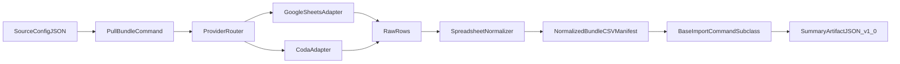

# Architecture

`migration_workbench` separates migration work into three layers:

1. **Connectors** (`connectors/*`): provider adapters (Google Sheets and Coda).
2. **Profiler** (`profiler/*`): normalizes tabular source rows into a deterministic CSV bundle.
3. **Importer** (`importer/*`): Django command chassis for preflight/apply, summary artifacts, and structured failures.

## Profiler commands (read-only)

The **`profiler`** app exposes management commands used before bundle design: Google Sheets / Drive (`profile_preflight`, `profile_drive_folder`, `profile_tab`, `scan_formula_patterns`, `profile_cohort_corpus`) and Coda (`profile_coda_preflight`, `profile_coda_doc`, `profile_coda_table`, `scan_coda_formula_columns`, `profile_coda_corpus`). They do not mutate Django models; artifacts are JSON/Markdown on disk. Coda-specific helpers live in `connectors/coda_source.py`; the multi-doc orchestrator is `profiler/tools/coda_corpus.py` (Sheets equivalent: `profiler/tools/cohort_corpus.py`).
