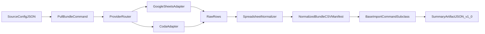

# Architecture

`migration_workbench` separates migration work into four layers:

1. **Connectors** (`connectors/*`): provider adapters (Google Sheets and Coda).
2. **Profiler** (`profiler/*`): normalizes tabular source rows into a deterministic CSV bundle.
3. **Importer** (`importer/*`): Django command chassis for preflight/apply, summary artifacts, and structured failures.
4. **Workbook** (`workbook/*`): turns profiler JSON + bundle config into **schema contract** YAML (and optional `models.py` stubs) for product repos to refine into real Django models.
5. **Deployment** (`deployment/*`): validates per-space deployment manifests, records release metadata, and provides the `wb` CLI surface (`manifest lint`, `deploy --dry-run`).

## Django project layout

- **Standalone:** this repo’s root [`manage.py`](../manage.py) uses `migration_workbench.settings` for development, `chassis-gate`, and running commands against the packaged apps.
- **Embedded:** product repositories (e.g. farm, vizcarra-guitars) install `migration-workbench` editable, provide **their own** `manage.py` and `config.settings`, and list the same apps (`connectors`, `profiler`, `importer`, `workbook`, …) in `INSTALLED_APPS`.

## Profiler commands (read-only)

The **`profiler`** app exposes management commands used before bundle design: Google Sheets / Drive (`profile_preflight`, `profile_drive_folder`, `profile_tab`, `scan_formula_patterns`, `profile_cohort_corpus`) and Coda (`profile_coda_preflight`, `profile_coda_doc`, `profile_coda_table`, `scan_coda_formula_columns`, `profile_coda_corpus`). They do not mutate Django models; artifacts are JSON/Markdown on disk. Coda-specific helpers live in `connectors/coda_source.py`; the multi-doc orchestrator is `profiler/tools/coda_corpus.py` (Sheets equivalent: `profiler/tools/cohort_corpus.py`).

## Workbook commands

- **`scaffold_workbook_schema`**: reads a pull-bundle style JSON config (`tabs[]`, `required_headers`) plus optional `profile_coda_doc` / `profile_coda_table` outputs, and writes a **schema contract** YAML for human review. Example inputs: [`example_data/scaffold_workbook_bundle.example.json`](../example_data/scaffold_workbook_bundle.example.json), [`example_data/scaffold_workbook_table_profile.example.json`](../example_data/scaffold_workbook_table_profile.example.json).
