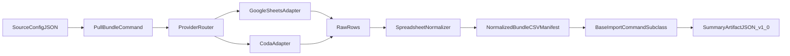

# Architecture

`migration_workbench` separates migration work into three layers:

1. **Connectors** (`connectors/*`): provider adapters (Google Sheets and Coda).
2. **Profiler** (`profiler/*`): normalizes tabular source rows into a deterministic CSV bundle.
3. **Importer** (`importer/*`): Django command chassis for preflight/apply, summary artifacts, and structured failures.

